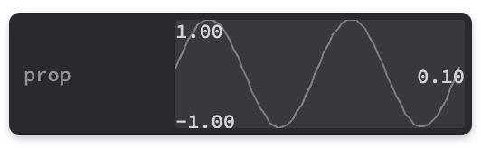

# Tweakpane Graph Plugin

Graph plugin for [Tweakpane](https://github.com/cocopon/tweakpane). Similar to the built-in graph monitor but with auto-scaling, and min/max/last values displayed as well.



## Installation

### Browser

```html
<script type="module">
    import { Pane } as Tweakpane from 'https://cdn.jsdelivr.net/npm/tweakpane@4.0.1/dist/tweakpane.min.js';
    import * as TweakpaneGraphPlugin from './tweakpane-plugin-graph.min.js';
    const pane = new Pane();
    pane.registerPlugin(TweakpaneGraphPlugin);
</script>
```

### Package

```js
import { Pane } from 'tweakpane';
import * as TweakpaneGraphPlugin from 'tweakpane-plugin-graph';
const pane = new Pane();
pane.registerPlugin(TweakpaneGraphPlugin);
```

## Usage

```js
const params = {
    val: 0.0,
};
setInterval(() => {
    params.val = Math.random() * 2.0 - 1.0;
}, 100);

const pane = new Pane();
pane.addBinding(params, 'val', { view: 'graph2', readonly: true });
window.pane = pane;
```